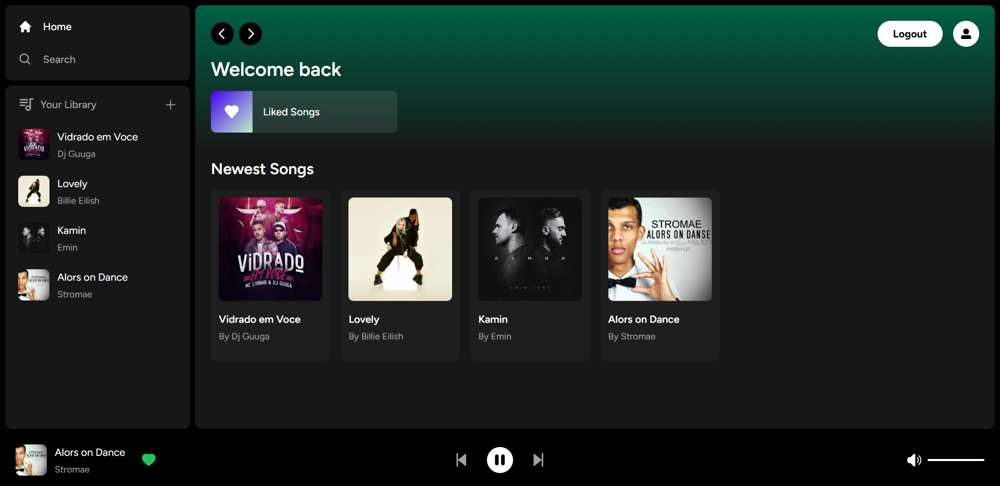

# NextJS Spotify Clone

A web application that mimics the core functionality of Spotify, built with NextJS and Supabase. This project allows users to authenticate, browse playlists, play music, add songs to favorites, and control playback, offering a familiar user experience similar to the popular music streaming service.

## 🚀 Live Demo

Experience the clone live: [https://spotify-clone-momen.vercel.app/](https://spotify-clone-momen.vercel.app/)

## 📸 Screenshots

Here's a glimpse of the application's interface.

## ✨ Features

- **User Authentication:** Securely log in using email & password or your GitHub account, powered by Supabase Auth.
- **Playlist Management:** View your personalized playlists.
- **Favorite Songs:** Add and manage your favorite tracks.
- **Music Playback:** Play, pause, skip to next/previous tracks, and control volume.

## 🛠️ Technology Stack

This project is built using a modern and robust technology stack:

- **Frontend:**
  - [Next.js](https://nextjs.org/) - React framework for production.
  - [Tailwind CSS](https://tailwindcss.com/) - A utility-first CSS framework for rapid UI development.
  - [Shadcn UI](https://ui.shadcn.com/) - Reusable components built with Radix UI and Tailwind CSS.
  - [Zustand](https://zustand.surge.sh/) - A small, fast, and scalable bearbones state-management solution.
  - [React Icons](https://react-icons.github.io/react-icons/) - SVG React icons of popular icon packs.
- **Backend & Database:**
  - [Supabase](https://supabase.io/) - An open-source Firebase alternative providing a PostgreSQL database, authentication, instant APIs, and real-time subscriptions.
- **Deployment:**
  - [Vercel](https://vercel.com/) - Cloud platform for frontend developers, enabling instant deployments.

## 🎓 Credit and Acknowledgement

This project was developed by following a comprehensive YouTube tutorial:

- [Next.js 13 Spotify Clone Tutorial](https://www.youtube.com/watch?v=2aeMRB8LL4o)

## 🔗 Connect with Me

- **GitHub:** [https://github.com/momen5406](https://github.com/momen5406)
- **LinkedIn:** [https://www.linkedin.com/in/momen5406/](https://www.linkedin.com/in/momen5406/)
- **Portfolio:** [https://momenhussein.vercel.app/](https://momenhussein.vercel.app/)
